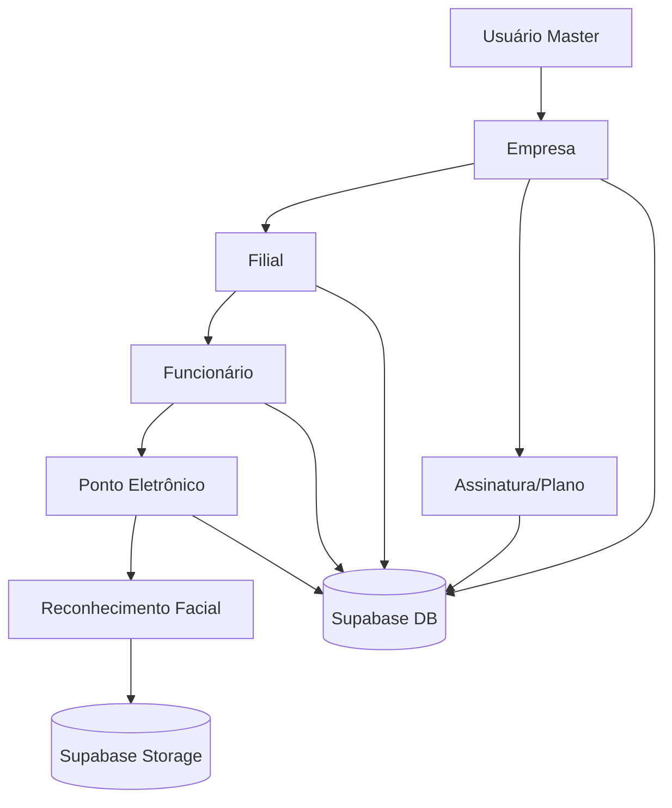

# PONTO VERIFICADO – Sistema de Ponto Eletrônico com Biometria Facial

## Visão Geral

O **PONTO VERIFICADO** é um sistema moderno de controle de ponto eletrônico, desenvolvido para empresas que desejam gerenciar a jornada de trabalho de seus funcionários de forma segura, eficiente e inovadora. O grande diferencial é o uso de **biometria facial** para o registro de ponto, além de uma arquitetura multiempresa e multifilial.

---

## Funcionalidades Principais

- Registro de ponto por reconhecimento facial
- Gerenciamento de empresas, filiais e funcionários
- Controle de assinaturas e planos
- Relatórios e dashboards customizados
- Hierarquia de acesso: Master, Empresa, Filial, Funcionário
- Logs e auditoria de ações

---

## Tecnologias Utilizadas

- **Frontend:** React, TypeScript, Vite, Tailwind CSS, shadcn-ui
- **Backend/Banco:** Supabase (PostgreSQL, autenticação, storage, RLS)
- **Infraestrutura:** Modular, separando componentes, hooks, integrações, páginas, etc.

---

## Fluxo de Usuários e Hierarquia

- **Master:** Acesso total ao sistema, gerenciamento global
- **Empresa:** Gerencia filiais, funcionários e assinatura
- **Filial:** Gerencia funcionários locais e registro de ponto
- **Funcionário:** Apenas registra ponto via biometria facial

O fluxo de login diferencia o tipo de usuário e direciona para o dashboard correspondente.

---

## Autenticação e Permissões

- **Login:** Feito via formulário, validando credenciais no Supabase (`users` ou `master_users`)
- **Validação de Assinatura:** Antes de permitir login de empresa, verifica status da assinatura (ativa, suspensa, cancelada, período de graça)
- **Permissões:** Controladas por tipo de usuário e políticas RLS no banco

---

## Sistema de Ponto com Biometria Facial

- Funcionário ativa a câmera, tira foto e o sistema realiza (ou simula) o reconhecimento facial
- Busca funcionário ativo na filial, compara biometria e registra ponto se confiança for suficiente
- Fotos e dados biométricos são salvos no Supabase Storage e tabelas específicas
- Cada tentativa de reconhecimento e registro de ponto é logada para auditoria

---

## Estrutura do Banco de Dados

Principais tabelas:
- `companies`: Empresas cadastradas
- `users`: Usuários da empresa (admin, manager, supervisor, user)
- `master_users`: Usuários master do sistema
- `branches`: Filiais das empresas
- `employees`: Funcionários das filiais (dados pessoais e biométricos)
- `employee_punch_records` e `punch_records`: Registros de ponto
- `company_subscriptions`: Controle de assinaturas e planos
- `subscription_plans`: Planos disponíveis
- `payment_history`: Histórico de pagamentos
- `user_biometric_photos`, `biometric_verification_logs`, `face_recognition_logs`: Dados e logs de biometria

**Relacionamentos:**
- Uma empresa tem várias filiais
- Uma filial tem vários funcionários
- Usuários pertencem a empresas
- Funcionários registram pontos, que são vinculados à filial e ao funcionário
- Assinaturas e planos vinculados à empresa

---

## Segurança

- **RLS (Row Level Security):** Ativado em todas as tabelas sensíveis
- **Senhas:** (Atenção) Atualmente armazenadas em texto puro – recomenda-se uso de hash seguro em produção
- **Uploads:** Buckets de storage com políticas de acesso restritas

---

## Diferenciais e Pontos de Atenção

### Diferenciais:
- Reconhecimento facial para registro de ponto
- Controle de assinatura com bloqueio automático por inadimplência
- Hierarquia multiempresa/multifilial
- Relatórios customizados e logs detalhados

### Pontos de Atenção:
- Senhas em texto puro: Risco de segurança, recomenda-se uso de hash seguro (bcrypt, argon2, etc.)
- Reconhecimento facial simulado: Para produção, integrar com serviço real de biometria
- Políticas RLS permissivas: Refinar para produção, restringindo acesso conforme papel do usuário
- Validação de dados: Garantir que uploads e dados sensíveis sejam validados e auditados

---

## Sugestões de Melhoria

- Implementar hash seguro para senhas
- Refinar políticas RLS para acesso granular
- Integrar reconhecimento facial real (ex: AWS Rekognition, Azure Face API)
- Adicionar logs de auditoria para todas as ações críticas
- Melhorar UX para feedbacks de erro e sucesso
- Testes automatizados para fluxos críticos

---

## Resumo Visual da Arquitetura

---

Se quiser uma análise ainda mais detalhada de algum módulo, fluxo ou código específico, é só pedir!
